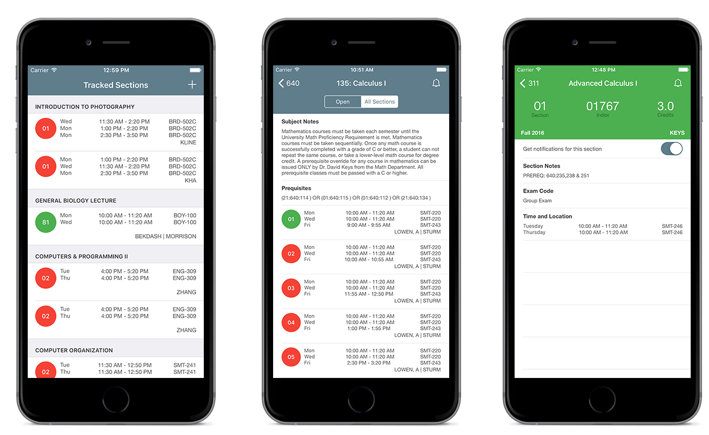

University Course Tracker 
======================

    

## Motivations?

Ever since Rutgers Course Tracker launched in February 2015 on Android, I've received many requests for an iOS version, but I lacked the necessary tools to do so at the time. Namely an iOS device, OSX machine and most importantly, $100. 

There were also some pressing concerns regarding the existing application's architecture. At the time, each Android device would intermittently scrape Rutgers servers then schedule notifications to be sent. Doing all of this work locally puts great strain of the CPU and consequently, the battery. 

Before any larger expansion was to be made, I needed to move all of the heavy lifting to a server. This solves my battery usage problem, but the larger benefit was that it consolidated my business logic behind an API. This allowed me to remove a significant amount of code from the Android build and it cleared the way for an iOS version.

## How was it made?

The API I designed for the client apps responds with JSON or Protobufs depending on client support. I found JSON serialization and deserialization with Swift to be very tedious, especially considering the number of object models my API utilizes. In my case Protobuf was the way to go. I had my `.proto` files and the [alexeyxo/protobuf-swift](https://github.com/alexeyxo/protobuf-swift) library easily generated my models with some immutatablity sprinkled on top.

I must admit I did not strictly follow some of the established iOS application architectural models like MVVM or MVC. I carried over some of what I learned in Android and Java. But it's always best to use basic software design patterns when in uncharted territory. 

Coming from Android where documentation for a component is spread between 3 Google+ posts, 2 Medium articles, a Google I/O talk and a stack overflow comment, by comparison, Apple's documentation is a dream.

## Requirements

- Xcode 8+
- Swift 3

## Libraries

The libraries and tools used include:

- [Alamofire](https://github.com/Alamofire/Alamofire) 
- [ProtocolBuffers-Swift](https://github.com/alexeyxo/protobuf-swift) 
- [CocoaLumberjack](https://github.com/CocoaLumberjack/CocoaLumberjack) 
- [PureLayout](https://github.com/PureLayout/PureLayout) 
- Firebase
